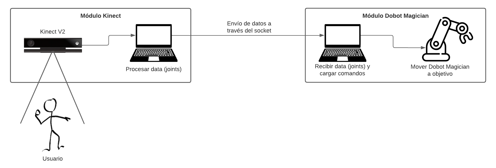
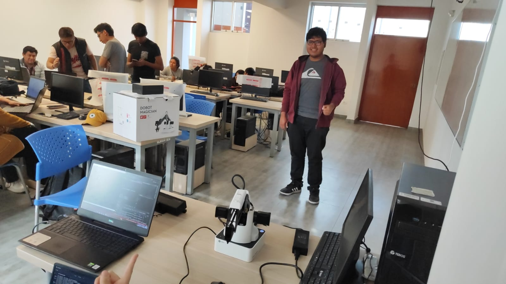
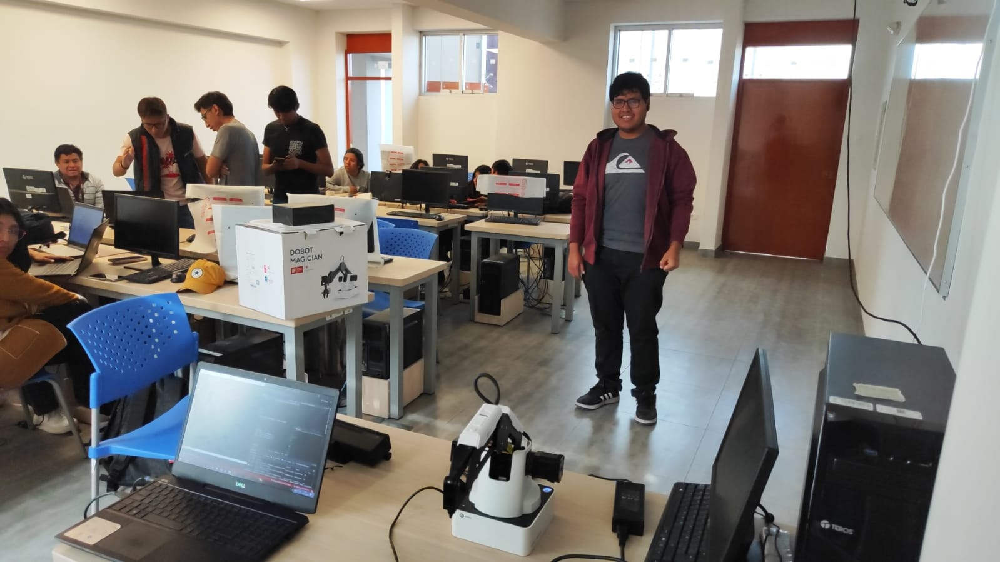
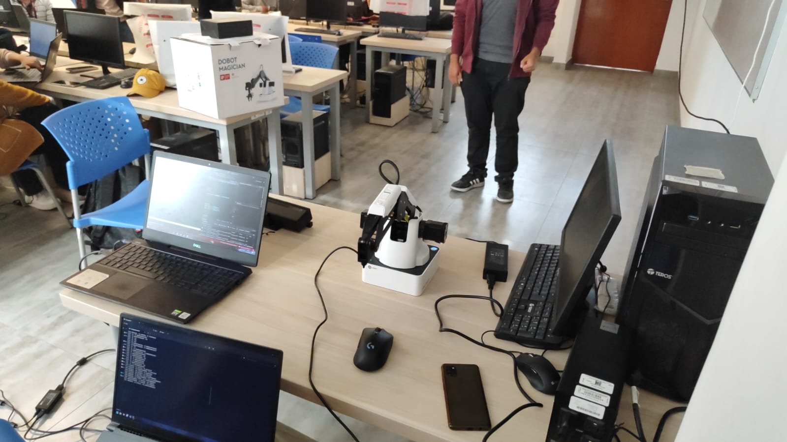
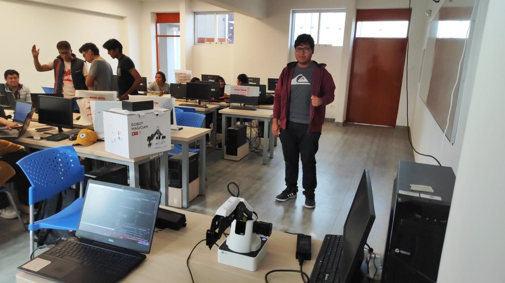
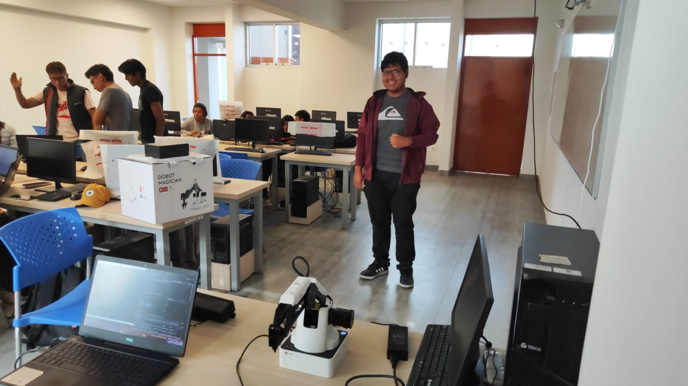
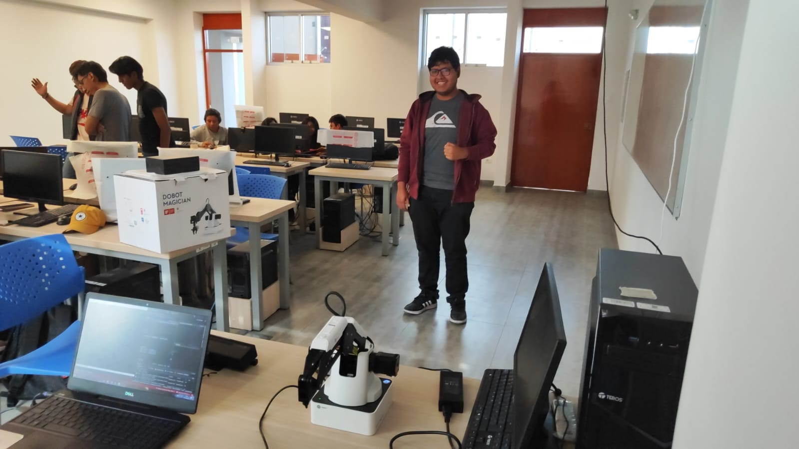
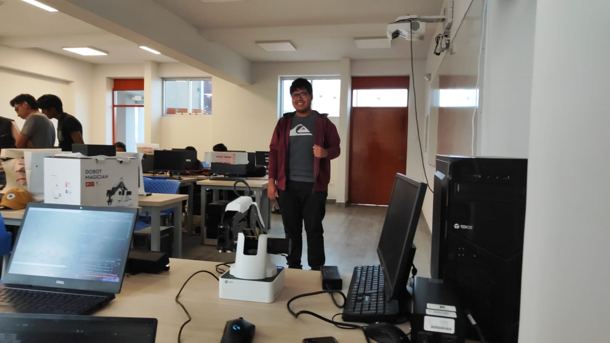
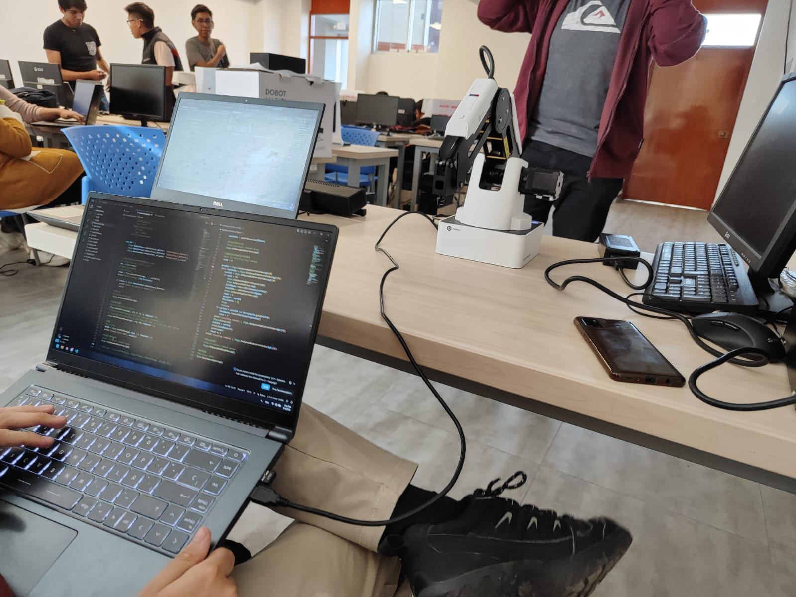

# Proyecto Rovotín
Proyecto de interacción humano-robot para el curso de Tópicos en Computación Gráfica.

## Integrantes

1. VILCHEZ MOLINA, Misael Svante
2. PERCA QUISPE, Joel Cristian
3. ESPINOZA PEÑALOZA, Edgar Alfonso
4. GUTIERREZ ENRIQUEZ, Erick

## Descripción
La propuesta de nuestro proyecto obedece al objetivo de hacer un seguimiento del brazo humano utilizando visión computacional y su sincronización con un brazo robótico. Para ello planteamos el empleo del dispositivo Kinect para realizar la extracción del movimiento del brazo humano en términos computacionales, posterior a ello trasladar dichos movimientos al entorno del robot Dobot Magician gracias a su API, de esta manera los movimientos que realice el usuario con su propio brazo se verán reflejados e imitados por el brazo robótico Dobot Magician.

## Arquitectura

Para la arquitectura del sistema definimos dos módulos:
- **Módulo Kinect:**  Esta se compone del dispositivo Kinect que nos permite rastrear los movimientos del cuerpo humano en tiempo real. Utiliza algoritmos avanzados para detectar y seguir las articulaciones y movimientos de las personas, reconstruyendo. La implementación de este módulo se llevó a cabo utilizando el lenguaje de C++ y, por lo tanto, las bibliotecas utilizadas para este módulo están orientadas a dicho lenguaje. El haber utilizado C++ para este módulo resultó en un beneficio en el rendimiento, al menos en el mismo módulo Kinect, pues la velocidad a la que se capturan y procesan los fotogramas y los joints es bastante rápida y eficiente.
- **Módulo Dobot Magician:** Esta se compone del dispositivo Dobot Magician al que, mediante la API de DobotStudio y DobotLab, se le es transmitido la información de los joints provenientes del módulo Kinect y de esta forma definir desde una script la secuencia de posiciones que el brazo robótico debe interpolar o, dicho en otras palabras, el recorrido o movimientos que el brazo robótico debe realizar. La implementación de este módulo se realizó utilizando el lenguaje de programación Python.

Cabe destacar que estos módulos se desenvuelven en ordenadores diferentes así, un ordenador se encarga del registro y el tratamiento de los datos de Kinect.

*Figura 1: Overview de la arquitectura del sistema de nuestra propuesta.*

Cómo se puede apreciar en la Figura 1, denominamos **módulo Kinect** al conjunto de la cámara Kinect y el ordenador en sistema operativo Windows 10 (limitación propia de la SKD oficial de Kinect) que se encarga de la captura de los *joints*, el procesamiento de la data, es decir la normalización de las posiciones de la mano en un sistema de referencia unitario, así como la serialización de dichos datos, para operar con un cliente de *socket* para la transmisión de dichos datos por este canal. Por otro lado, el **módulo Dobot Magician** se compone del brazo robótico Dobot Magician y el ordenador en sistema operativo Windows 11 que se encarga de recibir las coordenadas espaciales de los *joints*, reescalar los vectores, transformarlos al sistema de coordenadas del robot y mediante estos puntos remapeados delimitar la trayectoria que el brazo robótico debe seguir.

## Resultados

